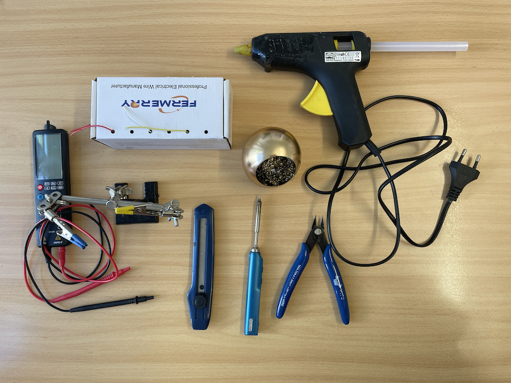

# GitHub issue tracker

> IOT project to monitor the amount of GitHub issues of a organisation.


We as Netresearch using GitHub to publish our open source projects.
It is very important to us, to respond to the issues and pull requests as fast as possible. Therefore we have implemented a display of the current status of
open issues and pull requests to have a quick overview of the current state.

## Requirements

If you want to use this project for your own organisation, you need to have a a little bit of hardware. The display should be connected to a power supply and to the internet.

### Hardware

- [x] A4 Picture frame
- [x] ESP 8266 Wemos D1 mini
- [x] USB power supply unit 5V 0,5A
- [x] OLED Display

### Tools



To put the project together, you need some tools.

#### Soldering

- [x] Soldering iron
- [x] Soldering grease
- [x] Tin
- [x] Helping hand
- [x] Cleaning sponge

#### Cable

- [x] Silicon cables 25AWG for the wiring
- [x] Micro USB cable to flash the ESP8266

### Software requirements

- VSCode
- PlatformIO plugin
- USB serial driver (MacOS, Windows)

## Software

### Features

- [x] OTA
- [x] Configurable
  - [x] Organisation
  - [x] Token
  - [x] WiFi credentials
- [x] Polling GitHub API

## GraphQL

It uses the GitHub GraphQL API to get the data. If you want, you can play around with the GraphQL queries in the [GitHub GraphQL Explorer](https://docs.github.com/en/graphql/overview/explorer).

```gql
{ search(
    query: "org:netresearch state:open", type: ISSUE) { 
        issueCount
    }
}
```

## Documentation

### Photos

- [x] Parts overview
- [ ] Assembly
- [x] Result
- [ ] NR Logo

### Video

- [ ] Hardware assembling
- [ ] HowTo configuration
